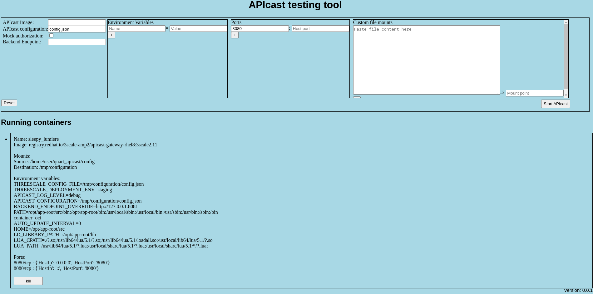

# quart_apicast
A simple UI to quickly setup and launch APIcast containers

## usage
* python -m venv .
* source bin/activate
* pip install -r requirements.txt
* ./run.sh
* visit `127.0.0.1:5000` on your browser